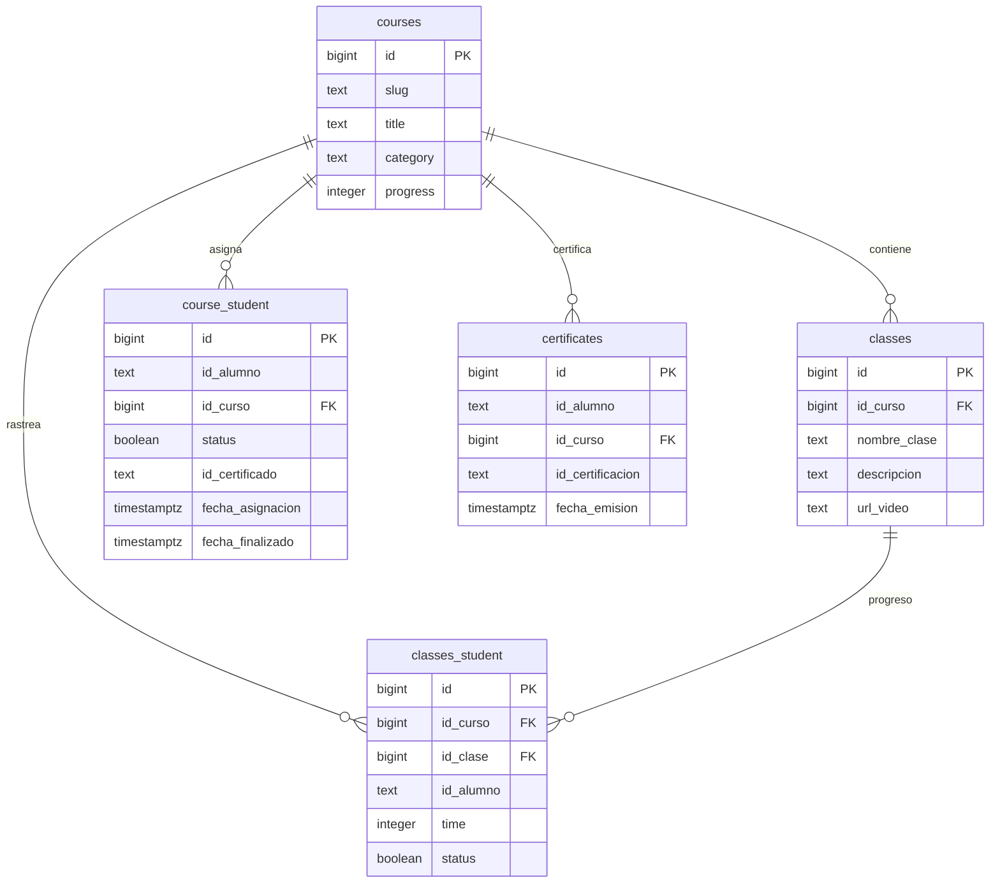
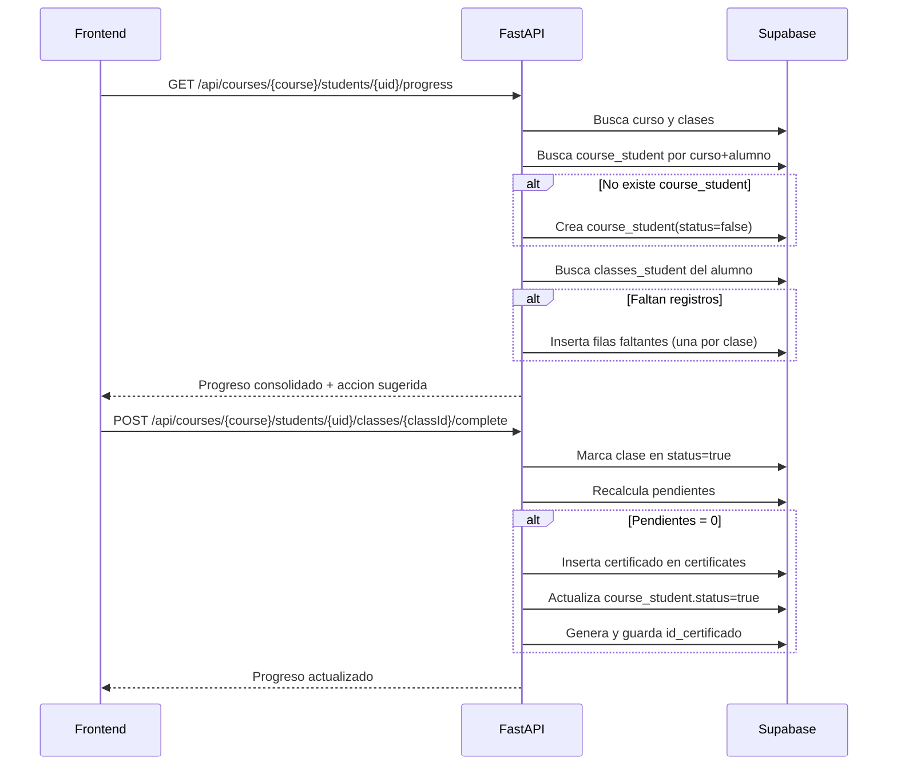

# Flujo de clases por alumno

Este documento cubre la implementacion de EL-13: registro de clases por curso, seguimiento por alumno y finalizacion con certificado.

## Estructura de datos

## Flujo funcional

## Endpoints nuevos

- `GET /api/courses/{course_ref}/students/{student_uid}/progress`
  - Crea registro de asignacion y detalle de clases si aun no existe.
  - Retorna clases completadas, pendientes, etiqueta de accion y certificado si aplica.
- `POST /api/courses/{course_ref}/students/{student_uid}/classes/{class_id}/complete`
  - Marca una clase como completada.
  - Recalcula estado del curso y genera certificado cuando ya no hay pendientes.

## Reglas de negocio implementadas

- Si el alumno entra al detalle de un curso por primera vez, se crea `course_student` con `status=false`.
- Se generan registros en `classes_student` por cada clase del curso para ese alumno.
- El avance del curso se calcula con base en `classes_student.status`.
- Cuando no quedan clases pendientes, `course_student.status` pasa a `true` y se guarda `id_certificado`.
- Al finalizar el curso, se crea un registro en `certificates` con `id_alumno` y `id_certificacion` unico.
- En frontend:
  - La pagina del curso abre un reproductor de YouTube con listado lateral de clases.
  - Se selecciona automaticamente la siguiente clase tomando como referencia la ultima clase completada.
  - Cada clase permite marcarse como completada manualmente.
  - Al terminar un video se marca la clase actual como completada (si estaba pendiente) y avanza a la siguiente.
  - Se muestra el codigo de certificado cuando el curso esta finalizado.
